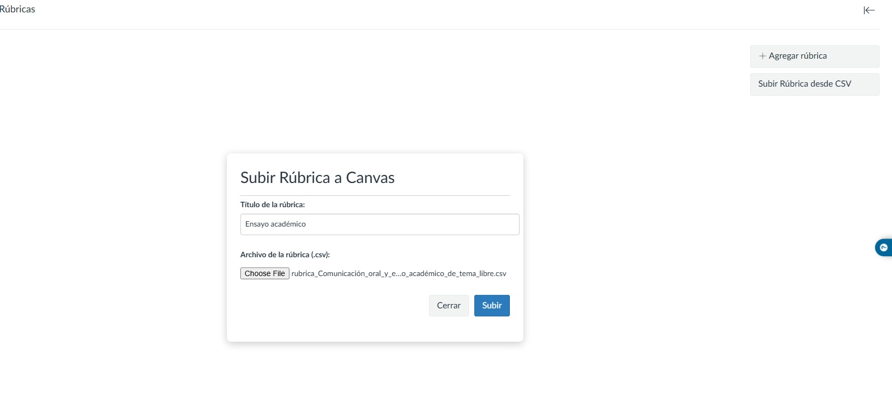
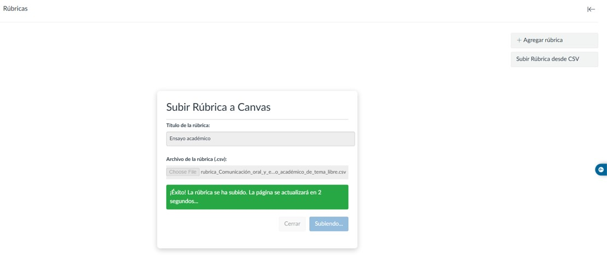
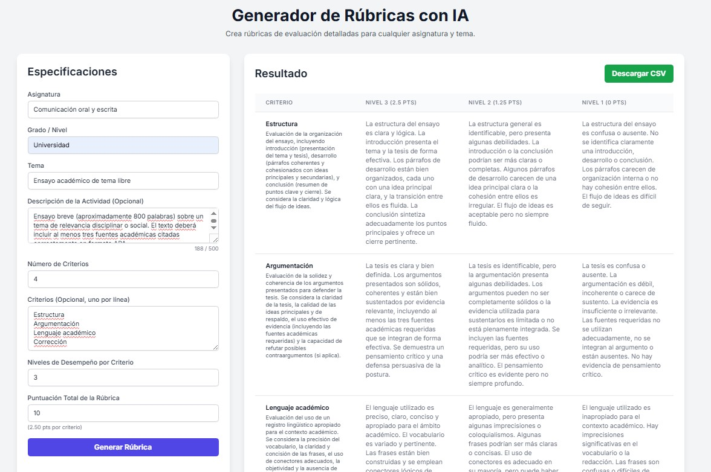

# Canvas Rubric Uploader

## Descripción

Este es un script de Tampermonkey (UserScript) diseñado para simplificar la creación de rúbricas en **Canvas LMS**. Permite a los educadores y diseñadores instruccionales subir rúbricas complejas directamente desde un archivo de formato `.csv`, eliminando la necesidad de crearlas manualmente, criterio por criterio, dentro de la interfaz de Canvas.

El script funciona de manera segura y eficiente, **sin necesidad de generar o gestionar tokens de acceso (API Keys)**, ya que utiliza el token de autenticación de la sesión activa del usuario para realizar las subidas.





## Características Principales

* **Subida Masiva desde CSV:** Crea rúbricas completas en segundos a partir de un archivo `.csv`.

* **Integración Transparente:** Añade un botón "Subir Rúbrica desde CSV" directamente en la interfaz de Rúbricas de Canvas.

* **Seguro y sin API Keys:** No requiere la generación de tokens de acceso. Utiliza la autenticación de tu sesión actual de Canvas.

* **No Sobrescribe:** Añade nuevas rúbricas a tu curso sin eliminar o modificar las que ya existen.

* **Flujo de Trabajo Eficiente:** Interfaz limpia y recarga automática para un proceso rápido y sin complicaciones.

## Instalación

Para utilizar este script, primero necesitas una extensión de gestión de UserScripts en tu navegador. La más popular es **Tampermonkey**.

1. **Instala Tampermonkey:**

   * [Tampermonkey para Chrome](https://chrome.google.com/webstore/detail/tampermonkey/dhdgffkkebhmkfjojejmpbldmpobfkfo)

   * [Tampermonkey para Firefox](https://addons.mozilla.org/es/firefox/addon/tampermonkey/)

   * [Tampermonkey para Edge](https://microsoftedge.microsoft.com/addons/detail/tampermonkey/iikmkjmpaadaobahmlepeloendndfphd)

   * [Tampermonkey para Safari](https://www.tampermonkey.net/?browser=safari)

2. **Instala el Script:**

   * Abre el archivo del script (`.js`) que te he proporcionado.

   * Tampermonkey detectará automáticamente el script y te mostrará una página de instalación.

   * Haz clic en el botón **`Instalar`**.

¡Eso es todo! El script estará activo la próxima vez que visites la página de Rúbricas en cualquiera de tus cursos de Canvas.

## Modo de Uso

1. Navega a la sección de **Rúbricas** de cualquier curso en Canvas (por ejemplo, `https://[tu-dominio].instructure.com/courses/[ID_CURSO]/rubrics`).

2. Verás un nuevo botón llamado **`Subir Rúbrica desde CSV`** debajo del botón "Añadir Rúbrica".

3. Haz clic en él. Aparecerá una ventana modal.

4. **Asigna un título** a tu nueva rúbrica.

5. **Selecciona el archivo `.csv`** que contiene los datos de la rúbrica.

6. Haz clic en **`Subir`**.

7. El script mostrará un mensaje de "¡Éxito!" y recargará la página automáticamente para que veas la nueva rúbrica en la lista.

## Formato del Archivo CSV y Generador Automático

### Generador de Rúbricas con IA (Recomendado)

Para facilitar la creación del archivo `.csv` con el formato correcto, puedes utilizar este generador de rúbricas basado en Gemini:

➡️ [**Generador de Rúbricas para Canvas**](https://g.co/gemini/share/f0fffe2448f2)



Simplemente describe la rúbrica que necesitas (por ejemplo, "una rúbrica para un ensayo de 5 criterios sobre la Revolución Francesa") y la IA generará el contenido en el formato exacto que el script necesita. El generador te permite descargar el resultado directamente como un archivo `.csv`, listo para subir a Canvas.

### Formato Manual del CSV

Si prefieres crear el archivo manualmente, debe tener la siguiente estructura de columnas:

`criterion,criterion_description,rating_description_1,rating_points_1,rating_description_2,rating_points_2,...`

**Explicación de las columnas:**

* `criterion`: El título corto del criterio (ej. "Claridad del Contenido").

* `criterion_description`: Una descripción más larga y detallada del criterio.

* `rating_description_1`: La descripción de la primera calificación (ej. "Excelente").

* `rating_points_1`: Los puntos para esa calificación (ej. `5`).

* `rating_description_2`, `rating_points_2`, etc.: Puedes añadir tantos pares de descripción/puntos como necesites para cada criterio.

**Ejemplo de un archivo `.csv` válido:**

```csv
criterion,criterion_description,rating_description_1,rating_points_1,rating_description_2,rating_points_2,rating_description_3,rating_points_3
Criterio 1,Claridad del contenido,Excelente,3.0,Bueno,2.0,Regular,1.0
Criterio 2,Organización del texto,Excelente,3.0,Bueno,2.0,Regular,1.0
Criterio 3,Gramática y ortografía,Excelente,3.0,Bueno,2.0,Regular,1.0
Criterio 4,Estilo y tono,Excelente,3.0,Bueno,2.0,Regular,1.0
Criterio 5,Originalidad,Excelente,3.0,Bueno,2.0,Regular,1.0
```

Guarda este contenido en un archivo con la extensión .csv, por ejemplo, rubrica_ejemplo.csv.

## Licencia

Este trabajo está bajo una Licencia Creative Commons Atribución 4.0 Internacional.

Aplicación realizada por Pablo G. Guízar con la invaluable ayuda de Gemini.
